Name : **Emad Eldin Adel Mahmoud Rezk** 

Email : emadeldin591970@gmail.com

Linkedin : https://www.linkedin.com/in/emad-eldin-adel/

Phone&WhatsApp : +201067456996


This README file contains the full solutions for both tasks With all required **Screenshots For Both Scenarios**

:
 **Q1: Custom Command (mygrep.sh)** and 
 **Q2: Web Dashboard Troubleshooting Scenario**.
 It includes all required steps, commands, bonus tasks, reflections, and embedded screenshots for validation.

---

# Q1 : Custom Command (mygrep.sh)

## **Overview** : 

This project implements a Bash script called `mygrep.sh`, which mimics the core functionality of the `grep` command. It allows searching for strings within text files, supporting various options such as showing line numbers and inverting matches.

## **Features**

- **Basic Search**: Case-insensitive string search within a text file.
- **Options Supported**:
  - `-n`: Display line numbers for each match.
  - `-v`: Invert the match, displaying lines that do not contain the search string.
  - Combinations of options like `-vn` and `-nv` are supported.

## **Requirements**

1. **Input Handling**:
   - Accepts two arguments: a search string and a text file.
   - Handles invalid inputs gracefully (e.g., missing arguments or files).
  
2. **Output**:
   - Mimics the output of `grep`, showing matching lines and line numbers if required.
  
3. **Testing**:
   - **Test File**: `testfile.txt` containing sample lines for validation.
   - **Test Cases**:
     - `./mygrep.sh hello testfile.txt`
     - `./mygrep.sh -n hello testfile.txt`
     - `./mygrep.sh -vn hello testfile.txt`
     - `./mygrep.sh -v testfile.txt` (Expect a warning for missing string).

## **How to Use**

### Make the script executable:
```bash
chmod +x mygrep.sh
```
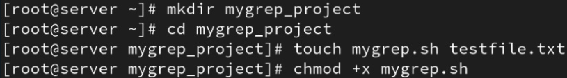

### Run the script:

```bash
./mygrep.sh [options] pattern file
```

### Example Commands:

1. **Basic Search**:

   ```bash
   ./mygrep.sh hello testfile.txt
   ```

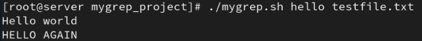

**Search with Line Numbers**:

   ```bash
   ./mygrep.sh -n hello testfile.txt
   ```

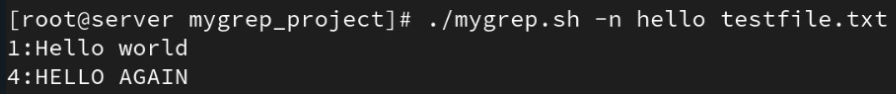
3.
 **Inverted Match**:

   ```bash
   ./mygrep.sh -vn hello testfile.txt
   ```

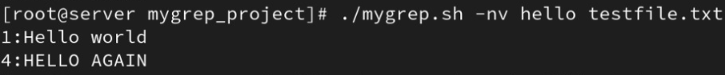
4. 
**Error (Missing Search String)**:

   ```bash
   ./mygrep.sh -v testfile.txt
   ```

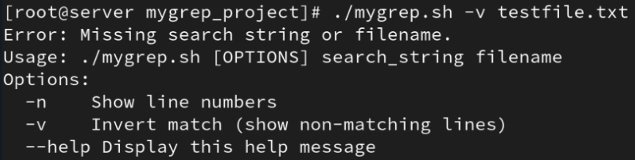
5. 
**Help Command** (Displays usage instructions):

   ```bash
   ./mygrep.sh --help  		#   Bonus Feature
   ```

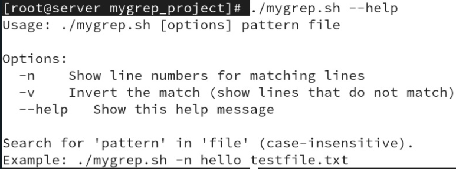
# Q2 : Scenario

## Troubleshooting DNS and Network Connectivity Issue 

##  Task Description

The internal web dashboard (`internal.example.com`) *<u>**note i will use my local dns as (server.iiss.com)**</u>* became unreachable from multiple systems. Although the service appeared running, users were getting **"host not found"** errors.

**Goal:**
 Troubleshoot, verify, and restore the connectivity to the internal service.

------

##  Steps to Resolve

### 1. Verify DNS Resolution

First, we compared DNS resolution using `/etc/resolv.conf` and Google's public DNS `8.8.8.8`.

- Using `/etc/resolv.conf` DNS:

```bash
dig internal.example.com
```

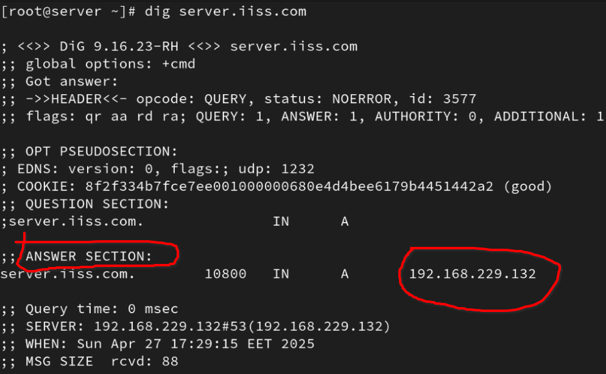
- Using Google's DNS:

```bash
dig google.com
```

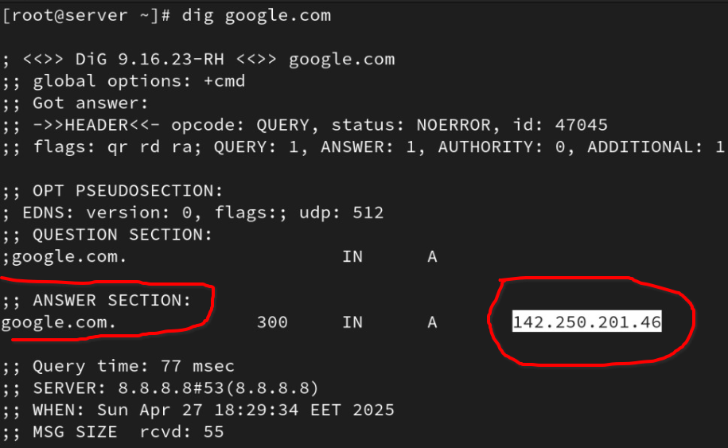
### 2. Diagnose Service Reachability

We verified if the web service was reachable on **port 80 (HTTP)** or **443 (HTTPS)**.

- Try connecting to the IP address:

```bash
telnet 192.168.229.132 80
telnet 192.168.229.132 443
```

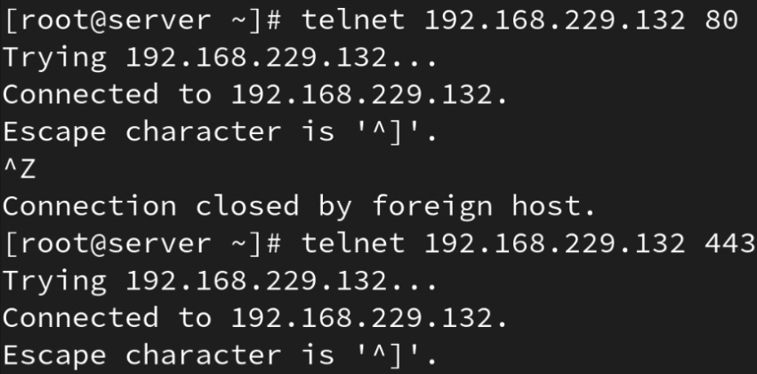
### 3. Trace the Issue – Potential Causes

**Possible reasons why `internal.example.com` was unreachable:**

- Wrong or missing DNS server in `/etc/resolv.conf`.
- `internal.example.com` record missing in DNS server.
- Firewall blocking ports 80/443.
- Web server not listening or not started.
- Network routing issues.

------

### 4. Propose and Apply Fixes

| Potential Issue         | How to Confirm                 | How to Fix                        |
| ----------------------- | ------------------------------ | --------------------------------- |
| Incorrect DNS server    | `cat /etc/resolv.conf`         | Update DNS settings               |
| DNS record missing      | `dig internal.example.com`     | Add DNS entry or use `/etc/hosts` |
| Firewall blocking ports | `sudo firewall-cmd --list-all` | Open HTTP/HTTPS ports             |
| Web server not running  | `systemctl status  / `apache   | Start/enable the service          |

------

## Commands Used to Fix Issues

### Firewall: Open HTTP (80) and HTTPS (443)

```bash
# Allow HTTP
sudo firewall-cmd --permanent --add-service=http

# Allow HTTPS
sudo firewall-cmd --permanent --add-service=https

# Reload firewall to apply changes
sudo firewall-cmd --reload

# Verify open services
sudo firewall-cmd --list-all
```

------

###  Web Server: Start/Enable Service

If the service was not running, we restarted and enabled it:

```bash
# For Apache
sudo systemctl start httpd
sudo systemctl enable httpd
sudo systemctl status httpd
```

------

###  Update DNS Settings Using NetworkManager

```bash
# Add Google's DNS and internal DNS
sudo nmcli connection modify "System ens160" ipv4.dns "8.8.8.8 8.8.4.4 192.168.229.132"

# Restart connection
sudo nmcli connection down "System ens160"
sudo nmcli connection up "System ens160"

# Verify DNS
nmcli device show ens160 | grep IP4.DNS
```

------

##  Bonus Section

###  1. Bypass DNS with `/etc/hosts`

```bash
sudo nano /etc/hosts
```

Add:

```bash
192.168.229.132 server.iiss.com
```

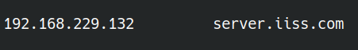Now the system resolves `internal.example.com` locally.

------

###  2. Persist DNS Settings

Used `nmcli` to permanently configure DNS servers through **NetworkManager**.

Commands:

```
sudo nmcli connection modify "System ens160" ipv4.dns "8.8.8.8 8.8.4.4 192.168.229.132"
sudo nmcli connection down "System ens160"
sudo nmcli connection up "System ens160"
```

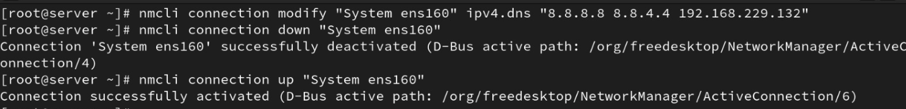